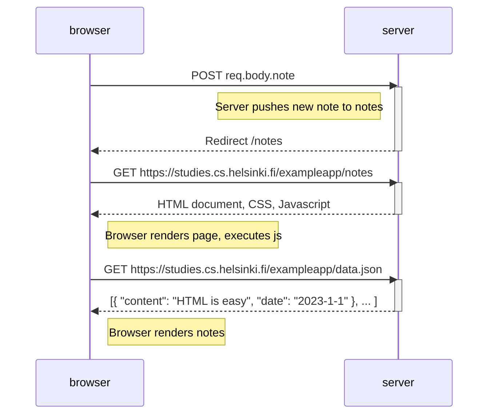

# New Note Diagram

```mermaid
sequenceDiagram
    participant browser
    participant server

    browser->>server: POST req.body.note
    activate server
    note left of server: Server pushes new note to notes
    server-->>browser: Redirect /notes
    deactivate server

    browser->>server: GET https://studies.cs.helsinki.fi/exampleapp/notes
    activate server
    server-->>browser: HTML document, CSS, Javascript
    deactivate server

    Note right of browser: Browser renders page, executes js


    browser->>server: GET https://studies.cs.helsinki.fi/exampleapp/data.json
    activate server
    server-->>browser: [{ "content": "HTML is easy", "date": "2023-1-1" }, ... ]
    deactivate server

    Note right of browser: Browser renders notes
```
