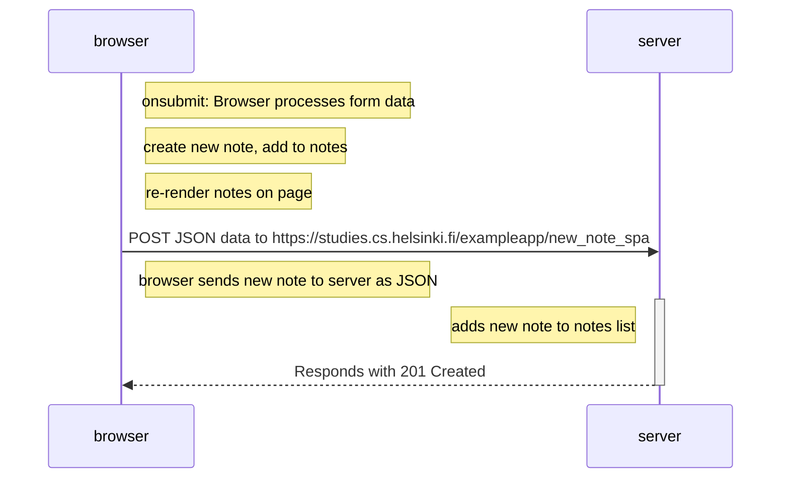

# SPA New Note Diagram

```mermaid
sequenceDiagram
    participant browser
    participant server

    Note right of browser: onsubmit: Browser processes form data
    Note right of browser: create new note, add to notes
    Note right of browser: re-render notes on page

    browser->>server: POST JSON data to https://studies.cs.helsinki.fi/exampleapp/new_note_spa
    Note right of browser: browser sends new note to server as JSON
    activate server
    Note left of server: adds new note to notes list
    server-->>browser: Responds with 201 Created
    deactivate server
```
